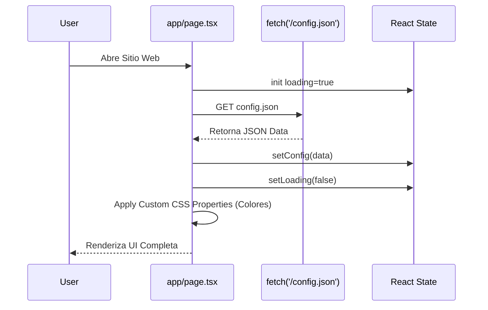
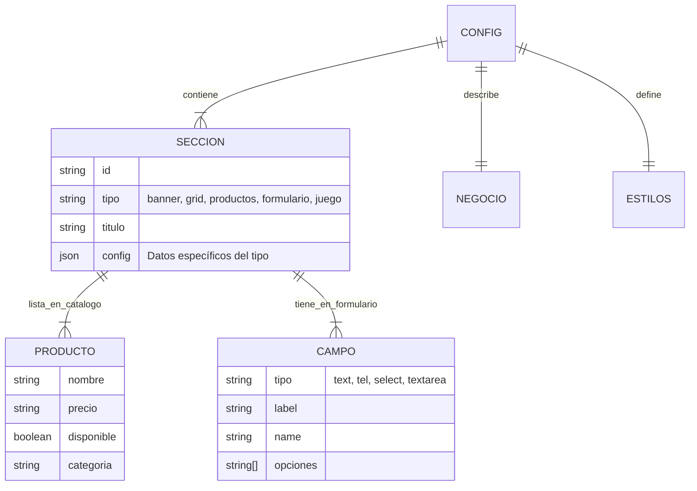

# DOCUMENTACION_TECNICA_COMPLETA_La_Estacion_del_play.md

**Fecha de Generación:** 11 de Febrero de 2026
**Versión del Documento:** 1.0.0
**Estado del Proyecto:** Prototipo Frontend / Landing Page Dinámica (JAMstack)

---

## 1. Información General

### Nombre del Proyecto
**La Estación del PlayStation**

### Descripción Detallada
Este proyecto es una **Landing Page Dinámica y Moderna** diseñada para un negocio de venta y reparación de consolas de videojuegos. A diferencia de un sitio estático tradicional, esta aplicación utiliza un archivo de configuración (`config.json`) para renderizar dinámicamente secciones, estilos, productos y servicios sin necesidad de modificar el código fuente.

El sistema funciona actualmente bajo una arquitectura **Client-Side Rendering (CSR)** con Next.js, donde el contenido se hidrata en el cliente basándose en la configuración cargada.

### Características Principales
*   **Motor de Renderizado Dinámico:** La UI se construye en tiempo de ejecución basada en un JSON array de "secciones".
*   **Theming en Tiempo Real:** Colores y tipografías configurables desde el JSON (Variables CSS).
*   **Minijuego Integrado:** Un juego de plataformas (Canvas API) para engagement de usuarios y sistema de cupones.
*   **Integración WhatsApp:** Sistema de cotización que genera enlaces directos a WhatsApp con mensajes pre-formateados.
*   **Diseño Responsivo & Gamer:** Estética "Cyberpunk/Gamer" con efectos de neón, gradientes y animaciones (TailwindCSS v4 + Framer Motion/CSS Animations).

### Casos de Uso
1.  **Portafolio de Servicios:** Mostrar reparaciones y mantenimientos disponibles.
2.  **Catálogo Digital:** Listar consolas, juegos y accesorios con stock (simulado).
3.  **Captación de Leads:** Formulario de cotización que deriva tráfico directo a ventas por chat.
4.  **Engagement:** Minijuego para retener usuarios y ofrecer descuentos.

---

## 2. Stack Tecnológico

### Frontend
*   **Framework:** [Next.js 16.0.10](https://nextjs.org/) (App Router)
*   **Librería UI:** [React 19.2.0](https://react.dev/)
*   **Estilos:** [TailwindCSS 4.1.9](https://tailwindcss.com/)
*   **Iconos:** [Lucide React](https://lucide.dev/)
*   **Animaciones:** CSS nativo + `tailwindcss-animate`
*   **Analytics:** `@vercel/analytics`

### Backend & Base de Datos (Estado Actual)
*   **Arquitectura:** Serverless / Static (JAMstack)
*   **Persistencia:** Archivo estático `public/config.json`
*   **API:** `fetch('/config.json')` (Cliente a Archivo Estático)

### Herramientas de Desarrollo
*   **Lenguaje:** [TypeScript 5](https://www.typescriptlang.org/)
*   **Linting:** ESLint
*   **Gestor de Paquetes:** (Implícito) npm/pnpm/yarn
*   **Validación:** Zod (instalado pero uso limitado en el código actual)

---

## 3. Arquitectura del Sistema

### Diagrama de Arquitectura (Estado Actual)

```mermaid
graph TD
    User[Usuario Final] -->|Visita| Browser[Navegador / Cliente]
    Browser -->|Solicita App| CDN[Vercel Edge / CDN]
    CDN -->|Entrega| NextApp[Next.js App Bundle]
    
    subgraph Client Side
        NextApp -->|Fetch| ConfigFile[public/config.json]
        NextApp -->|Renderiza| Components[Componentes Dinámicos]
        Components -->|Genera| Theme[Variables CSS Globales]
        Components -->|Renderiza| Sections[Secciones (Hero, Grid, Game)]
    end
    
    subgraph External Services
        Sections -->|Redirecciona| WA[WhatsApp API]
    end
```

### Flujo de Datos (Carga Inicial)



### Estructura de Directorios

```plaintext
/
├── app/                  # Next.js App Router
│   ├── layout.tsx        # Entry point, fuentes, metadata
│   ├── page.tsx          # Lógica principal de carga de config y renderizado
│   └── globals.css       # Estilos globales y capas de Tailwind
├── components/           # Biblioteca de Componentes UI
│   ├── ui/               # Componentes base (shadcn/ui - botones, inputs...)
│   ├── hero-section.tsx  # Sección Banner
│   ├── platform-game.tsx # Lógica del minijuego (Canvas)
│   ├── quote-form.tsx    # Formulario dinámico -> WhatsApp
│   └── ...               # Otros componentes de sección
├── lib/
│   ├── types.ts          # Definiciones de TypeScript (Interfaces del Modelo)
│   └── utils.ts          # Helpers (clsx, twMerge)
├── public/
│   └── config.json       # "Base de Datos" del proyecto
└── package.json          # Dependencias
```

---

## 4. Base de Datos (Modelo de Datos Lógico)

Aunque no existe una base de datos SQL, el archivo `lib/types.ts` y `public/config.json` definen un esquema estricto que actúa como tal.

### Modelo Entidad-Relación (Inferido)



### Definición de Interfaces TypeScript (`lib/types.ts`)
Estas interfaces deben respetarse rigurosamente al editar `config.json`.

```typescript
export interface Config {
  negocio: { ... }
  estilos: { ... }
  secciones: Seccion[] // Array polimórfico
  // ...
}

export interface Seccion {
  id: string
  tipo: string // Discriminador para el switch-case en page.tsx
  // Propiedades opcionales dependientes del tipo
  productos?: Producto[]
  campos?: Campo[]
  imagenes?: GaleriaImagen[]
  // ...
}
```

---

## 5. Backend (Análisis de Brecha)

**Estado Actual:** No implementado.
El proyecto delega toda la lógica "backend" a servicios de terceros o al cliente.

### Funciones Principales (Simuladas)
1.  **Cotización:** En lugar de guardar en BD, `QuoteForm` construye una URL `wa.me` con el mensaje pre-llenado y abre WhatsApp Web/App.
2.  **Configuración:** En lugar de una API REST, se lee un archivo estático.

### Propuesta de Arquitectura Backend (Futuro)
Para convertir este prototipo en una aplicación robusta:
1.  **Base de Datos:** PostgreSQL (via Supabase) para migrar `config.json` a tablas (`sections`, `products`, `leads`).
2.  **API:** Next.js Server Actions para manejar el envío de formularios y autenticación.
3.  **Admin Panel:** Una interfaz `/admin` protegida para editar el contenido del JSON/BD sin tocar código.

---

## 6. Frontend

### Estrategia de Renderizado
El componente principal `HomePage` (`app/page.tsx`) actúa como un **"Layout Engine"**.
Utiliza un patrón de **Renderizado Condicional por Tipo**:

```tsx
// Fragmento de app/page.tsx
{config.secciones.map((seccion) => {
  switch (seccion.tipo) {
    case "banner": return <HeroSection ... />
    case "grid":   return <ServicesSection ... />
    case "juego":  return <GameSection ... />
    // ...
  }
})}
```

### Componentes Clave

#### 1. `PlatformGame` (`components/platform-game.tsx`)
*   **Tecnología:** HTML5 Canvas API + `requestAnimationFrame`.
*   **Lógica:**
    *   Manejo de física simple (gravedad, velocidad).
    *   Detección de colisiones AABB (Axis-Aligned Bounding Box).
    *   Sistema de partículas/brillo simulado con comparaciones de sombra en Canvas context.
    *   Estado local para vidas, puntaje y posición.

#### 2. `QuoteForm` (`components/quote-form.tsx`)
*   **Motor:** Generador de formularios basado en metadata (`campos[]`).
*   **Renderizado:** Itera sobre el array de campos y selecciona el input correcto (`Select`, `Input`, `Textarea`).
*   **Integración:** Construye dinámicamente el mensaje de WhatsApp.

#### 3. `Navbar` & `Footer`
*   Reciben el objeto `config` completo para renderizar enlaces a redes sociales y configurar colores/logos dinámicamente.

### Hooks Utilizados
*   `useState`, `useEffect`: Manejo de carga de datos y estado del juego.
*   `useRef`: Referencias al Canvas para dibujo 2D.
*   `useCallback`: Optimización del loop de juego (`gameLoop`).

---

## 7. Sistema de Autenticación y Seguridad

**Estado:** 🔴 **No Implementado.**
Actualmente, el sitio es público y de solo lectura. No hay panel de administración ni usuarios.

**Recomendación de Implementación:**
1.  Integrar **Supabase Auth** o **NextAuth.js**.
2.  Crear rutas protegidas mediante Middleware de Next.js (`middleware.ts`).
3.  Implementar RLS (Row Level Security) si se migra a Supabase.

---

## 8. Sistema de Configuración Dinámica

El "corazón" del proyecto es su capacidad de reconfiguración sin código (No-Code like).

### Parámetros Configurables
| Categoría | Parámetro | Descripción |
| :--- | :--- | :--- |
| **Negocio** | `nombre`, `eslogan`, `logo` | Identidad básica del sitio. |
| **Estilos** | `colorPrincipal`, `colorSecundario` | Define la paleta CSS global (`--color-principal`). |
| **Layout** | `secciones` (Array) | El orden en el array define el orden visual en la página. |
| **Contacto** | `whatsapp`, `redes` | Enlaces y números de contacto. |

---

## 9. Convenciones y Mejores Prácticas

### Nomenclatura
*   **Archivos:** kebab-case (ej: `hero-section.tsx`, `quote-form.tsx`).
*   **Componentes:** PascalCase (ej: `HeroSection`).
*   **Interfaces:** PascalCase (ej: `Config`, `Producto`).

### Estilizado (Tailwind)
*   Uso de variables CSS (`var(--color-principal)`) dentro de las clases de utilidad arbitrarias de Tailwind (ej: `bg-[var(--color-principal)]`). Esto permite que el tema sea dinámico en tiempo de ejecución.
*   Diseño "Mobile First" implícito.

### TypeScript
*   Tipado estricto de la configuración (`Config` interface).
*   Uso de `type imports` para mejorar el tree-shaking.

---

## 10. Componentes Reutilizables (Catálogo UI)

Ubicados en `components/ui/` (basados en Shadcn/ui):
*   `Button`: Soporta variantes, tamaños y estados de carga.
*   `Card`: Contenedor con bordes y sombras para agrupar contenido.
*   `Input`, `Select`, `Textarea`: Elementos de formulario estilizados.
*   `Dialog` / `Sheet`: Para modales y menús móviles.

---

## 11. Patrones para Futuros Proyectos

### 1. "Config-Driven UI" (UI Dirigida por Configuración)
El patrón utilizado en `app/page.tsx` es altamente reutilizable para CMS sencillos.
*   **Patrón:** Definir un JSON Schema para las secciones y un componente "Dispatcher" que elija qué renderizar.
*   **Ventaja:** Permite crear múltiples sitios web cambiando solo el `config.json`.

### 2. Theming Dinámico con Variables CSS
La técnica de inyectar variables CSS en el `useEffect` inicial:
```javascript
document.documentElement.style.setProperty("--color-principal", data.estilos.colorPrincipal)
```
Permite que Tailwind use estas variables (`bg-[var(--...)]`) para cambiar el tema completo sin recompilar el CSS.

### 3. "WhatsApp-First" Commerce
Para negocios pequeños, eliminar el carrito de compras y reemplazarlo con un botón "Enviar Pedido por WhatsApp" reduce la fricción y costos de pasarelas de pago.

---

## 12. Roadmap y Mejoras Futuras

### Prioridad Alta (Esenciales)
- [ ] **Migración a Base de Datos:** Mover `config.json` a PostgreSQL/Supabase.
- [ ] **Panel de Administración:** Crear una interfaz `/admin` para editar textos y precios.
- [ ] **Optimización de Imágenes:** Reemplazar `img` tags y placeholders con `next/image`.

### Prioridad Media
- [ ] **Carrito de Compras Real:** Mantener estado de selección de productos antes de enviar a WhatsApp.
- [ ] **Blog/Noticias:** Nueva sección dinámica para SEO.

### Prioridad Baja
- [ ] **Pasarela de Pagos:** Integración con Stripe/Wompi.
- [ ] **Login de Usuarios:** Para seguimiento de pedidos (requiere backend completo).

---

_Este documento sirve como referencia técnica completa del estado actual del proyecto "La Estación del PlayStation"._
